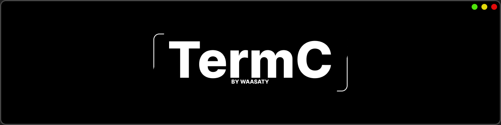

<p align="center">
  
  
  
</p>
A tiny Python library that makes terminal apps look way cooler with almost no effort.

No more boring `print()` spam.
No more ugly CLI menus.
Just clean banners, colorful messages, menus, separators, and stylish prompts.

---

## 📦 Installation

```bash
pip install termc
```

Or clone the repository:

```bash
git clone https://github.com/waasaty/termc.git
```
(PyPI support coming soon 🚧)

---

## 📕 Docs
https://apt29.gitbook.io/termc

---

## 💡 Why termc?

Because writing:

```python
print("[INFO] Application started")
```
for the 500th time gets boring.

termc gives your terminal projects a cleaner and more professional look while keeping everything simple.

---

## 🤝 Contributing

Found a bug?
Have an idea?
Open an issue or submit a pull request.

Contributions are always welcome.

---
Do whatever you want, just don't claim you wrote it ;)